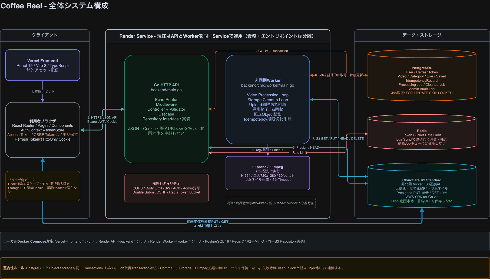
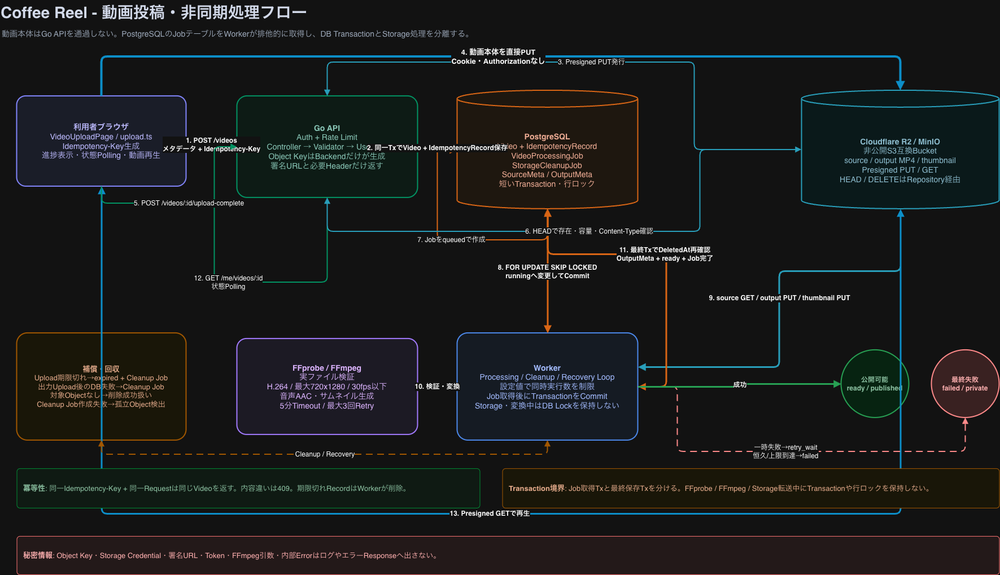

# Coffee_Reel

Coffee Reelは、**コーヒーに関連する縦型ショート動画を投稿・視聴できるWebアプリケーション**です。

ハンドドリップ、焙煎、ラテアート、コーヒー豆、器具など、文章や静止画だけでは伝わりにくい「動き」を短い動画で共有できます。

公開動画はリール形式で連続視聴でき、検索、いいね、お気に入り保存、動画投稿、自分の投稿管理、管理者によるユーザー・投稿管理まで実装しています。

## 本番環境

| URL                                  |
| ------------------------------------ |
| https://coffee-reel-rouge.vercel.app |

---

## このアプリで解決したいこと

| 課題                                                                                  | Coffee Reelでの解決                                                |
| ------------------------------------------------------------------------------------- | ------------------------------------------------------------------ |
| 淹れ方やラテアートは、文章や画像だけでは動きを理解しにくい                            | 10秒以内の縦型動画で手順や動きを共有する                           |
| コーヒー動画が複数のサービスに分散しており、目的の情報を探しにくい                    | コーヒー動画に特化し、タイトル・カテゴリーから検索できるようにする |
| 動画を1件ずつ開いて再生するのが手間                                                   | 縦スクロールのリール形式で連続視聴できるようにする                 |
| 気になった動画を後から探し直すのが手間                                                | お気に入りに保存し、保存一覧から再視聴できるようにする             |
| 気になる投稿者の他の動画を探しにくい                                                  | 投稿者名から、その投稿者の公開動画一覧へ移動できるようにする       |
| 投稿動画ごとに形式・解像度・音声条件が異なる                                          | WorkerがFFprobe / FFmpegで検証・変換し、公開用の形式へ統一する     |
| 動画変換のような負荷の高い処理をHTTPリクエスト内で実行すると、APIの処理を圧迫しやすい | 動画処理をジョブとWorkerへ分離し、APIと非同期処理の責務を分ける    |

---

## 主な機能

### ゲスト

- 公開リールの閲覧
- 動画詳細の閲覧
- 投稿者ごとの公開動画一覧
- タイトル検索
- カテゴリー検索
- タイトル + カテゴリーの複合検索
- 通常検索が0件だった場合の類似検索
- いいね件数の閲覧
- 会員登録
- ログイン

### ログインユーザー

- 動画投稿
- 投稿処理状況の確認
- 自分の投稿一覧・詳細
- 自分の投稿の非公開・再公開・削除
- 投稿者ごとの公開動画一覧
- いいね・いいね解除
- お気に入りへの保存・保存解除
- 保存一覧
- リール動画の音声ON / OFF
- ログアウト

### 管理者

- 一般ユーザー一覧・詳細
- ユーザーの利用停止・利用再開
- 投稿一覧・詳細
- 投稿の非公開・公開再開
- 管理操作の監査ログへの記録

---

## システム構成



```text
Browser
  │
  ├── React / TypeScript / Vite
  │
  ├── API Request
  │       │
  │       ▼
  │   Echo Router
  │       ↓
  │   Middleware
  │       ↓
  │   Controller
  │       ↓
  │   Validator
  │       ↓
  │   Usecase
  │       ↓
  │   Repository
  │      ├── PostgreSQL
  │      ├── Redis
  │      └── Object Storage
  │
  └── Presigned URL
          │
          ▼
      Object Storage
          ▲
          │
       Worker
          │
          ├── FFprobe
          └── FFmpeg
```

Backendでは、HTTP処理、業務ルール、永続化、外部I/O、動画処理の責務が混在しないように分離しています。

| 層         | 主な責務                                                                          |
| ---------- | --------------------------------------------------------------------------------- |
| Entity     | 状態、不変条件、状態遷移                                                          |
| DB         | PostgreSQL接続                                                                    |
| Repository | GORM、PostgreSQL、Redis、オブジェクトストレージ、行ロック、用途別トランザクション |
| Usecase    | 業務ルールと処理全体の流れ                                                        |
| Controller | HTTP入出力、Cookie、HTTPステータス、レスポンス                                    |
| Middleware | 認証、権限、CSRF、Rate Limit、Body Limit                                          |
| Validator  | 入力形式の検証・正規化                                                            |
| Router     | URL、HTTP Method、Middleware、Controllerの接続                                    |
| Worker     | 動画変換、再試行、ストレージ削除、異常終了後に残ったジョブの回収                  |
| Frontend   | API通信、認証状態、画面表示                                                       |

`backend/main.go`は、依存関係を組み立てる起点（Composition Root）として、設定値の読み込み、依存関係の生成・DI、サーバー起動、安全な終了処理（Graceful Shutdown）に限定しています。

環境設定の型は`backend/entity/config.go`、環境変数からの設定生成とRedis接続は`backend/model/`に分離しています。

---

## 設計上のポイント

### 1. 動画本体をAPIサーバーで中継しない

動画投稿時、Backendは動画本体をリクエストボディで受け取りません。

```text
Frontend
  ↓ 投稿情報を送信
Backend
  ↓ 署名付きPUT URLを発行
Frontend
  ↓ 動画本体を直接PUT
Object Storage
```

これにより、動画アップロードによるAPIサーバーのメモリ消費、通信負荷、タイムアウトを抑えています。

Object KeyはBackendが生成し、クライアントから任意の保存先を指定できないようにしています。

### 2. 動画変換を非同期Workerに分離

FFmpegのような負荷の高い処理をHTTPリクエスト内で実行せず、ジョブとして非同期処理します。



```text
Upload完了
  ↓
Job queued
  ↓
WorkerがJobを取得
  ↓
FFprobe
  ↓
入力検証
  ↓
FFmpeg変換
  ↓
サムネイル生成
  ↓
出力検証
  ↓
Object Storageへ保存
  ↓
ready / published
```

一時的な障害が発生した場合は再試行します。

動画形式の不正など、再試行しても解決しない恒久的なエラーや、試行上限へ到達した場合は`failed / private`へ変更し、一般公開しません。

Workerが異常終了した場合も、`running`のまま残ったジョブを検出して回収し、再試行または最終失敗へ遷移できる構成にしています。

### 3. DBとオブジェクトストレージの不整合に補償処理で対応

PostgreSQLとオブジェクトストレージは、同一トランザクションで同時にCommitできません。

そのため、一方の処理だけが成功した場合でも整合性を取り直せるよう、以下の補償処理を用意しています。

- ストレージ削除Job
- アップロード期限切れの回収
- Worker異常終了後に残ったJobの回収
- 孤立したObjectの検出
- 削除対象のObjectがすでに存在しない場合も、削除成功として扱う

動画削除時も、APIはストレージ上のファイル削除が完了するまで待ちません。

DB上で動画の削除状態とCleanup Jobを同一トランザクションで確定し、その後Workerが非同期でファイルを削除します。

### 4. 処理ごとのトランザクション

汎用的な`TxManager`は作成せず、トランザクションが必要な処理は、用途が明確なRepositoryメソッド内で完結させています。

例:

- Refresh Tokenのローテーション
- Refresh Token再利用検知時のFamily失効
- 動画投稿開始
- Upload完了
- 動画処理成功・失敗
- お気に入り保存
- いいね・いいね解除
- ユーザー利用停止・再開
- 管理者による投稿非公開・公開再開

Usecaseは`Begin / Commit / Rollback`を直接扱いません。

### 5. 同時実行と同じリクエストが再送されても、データが重複したり状態が壊れたりしないようにする対応

Coffee Reelでは、次のように対応しています。

- 動画投稿開始では`Idempotency-Key`を使用する
- Upload完了通知が再送されてもProcessing Jobを重複作成しない
- `video_likes`ではUser / Videoの複合一意制約によって重複いいねを防止する
- お気に入りも同じUser / Videoの組み合わせを重複保存しない
- いいねのPUT / DELETEを再送した場合も、現在の状態を返す
- 管理操作や動画状態変更では必要な行をロックし、更新直前に状態を再確認する
- User停止と動画公開状態の変更が競合した場合も、動画が意図せず公開されないようにする

---

## 動画処理

### 入力条件

| 項目           | 条件                            |
| -------------- | ------------------------------- |
| 最大時間       | 10秒                            |
| 最大容量       | 50,000,000 bytes以下            |
| Container      | MP4 / MOV                       |
| MIME           | `video/mp4` / `video/quicktime` |
| 縦横比         | 9:16                            |
| 最大解像度     | 1080 × 1920                     |
| 最大Frame Rate | 60 fps                          |
| 音声           | あり / なしの両方を許可         |

Frontendでも事前検証を行いますが、ブラウザから送信された拡張子、MIME、メタデータだけは信用しません。

WorkerがFFprobeを使用し、実際の動画ファイルを再検証します。

### 公開用動画

公開用動画はFFmpegで次の形式へ統一します。

- MP4
- H.264（`libx264`）
- 720 × 1280
- 30 fps
- CRF 23
- 最大Video Bitrate 3 Mbps
- Buffer 6 Mbps
- `veryfast` preset
- Video Encoder 1 thread
- 音声あり: AAC
- 音声なし: 映像のみのMP4
- Metadata / Chapterを削除
- `faststart`を有効化

変換後もFFprobeで再検証し、公開条件を満たした場合だけOutput Metaを保存します。

---

## 動画変換の性能改善

`document/パフォーマンス改善編.pdf`には、動画変換設定を変更した理由と、同一条件で比較した結果を記録しています。

測定条件:

- 10秒
- 1080 × 1920
- 60 fps
- H.264 / AAC
- 入力容量47,312,729 bytes
- 各段階3回測定
- 経過時間・CPU時間は中央値（Median）
- メモリ使用量は最大RSS

最大RSSは、処理中に使用したメモリ量の最大値を確認するための指標です。

| 段階       |         出力容量 | 入力容量からの削減率 | 経過時間中央値 | CPU時間中央値 |     最大RSS |
| ---------- | ---------------: | -------------------: | -------------: | ------------: | ----------: |
| 初期実装   | 23,424,942 bytes |                50.5% |        4.621秒 |      28.638秒 | 482,844 KiB |
| 通信量制御 |  4,124,534 bytes |                91.3% |        3.252秒 |      17.864秒 | 481,924 KiB |
| 現行設定   |  4,214,913 bytes |                91.1% |        6.910秒 |       8.991秒 | 230,404 KiB |

現行設定では「最短の処理時間」ではなく、Workerの同時実行数が1の小規模環境で、CPUとメモリの占有を抑えることを優先しています。

初期実装と比較すると、通信量制御によって出力容量を大幅に削減し、現行設定ではさらにCPU時間と最大RSSを抑えています。

---

## 動画の状態

### Processing Status

| 値           | 意味                         |
| ------------ | ---------------------------- |
| `uploading`  | Upload待ち・Upload中         |
| `expired`    | Upload期限切れ               |
| `uploaded`   | Upload完了                   |
| `processing` | 検証・変換・サムネイル生成中 |
| `ready`      | 動画処理完了                 |
| `failed`     | 最終失敗                     |

### Publish Status

| 値          | 意味               |
| ----------- | ------------------ |
| `private`   | 一般非公開         |
| `published` | 一般公開           |
| `hidden`    | 管理者による非公開 |

一般ユーザーへ公開する条件は、次の3つです。

```text
processing_status = ready
publish_status = published
deleted_at IS NULL
```

リール、検索、動画詳細、保存、いいね、投稿者別一覧では、すべて同じ公開条件を使用します。

---

## 検索

公開動画検索は、既存の`GET /videos`へ統合しています。

### 検索方式

| 条件                       | 動作                                  |
| -------------------------- | ------------------------------------- |
| 条件なし                   | 公開動画を新しい順で取得              |
| `title`                    | 大文字・小文字を区別しない部分一致    |
| `category`                 | 定義済みカテゴリーとの完全一致        |
| `title + category`         | AND条件                               |
| `author_id`                | 指定した投稿者の公開動画へ絞り込み    |
| `title`を含む通常検索が0件 | `pg_trgm`を使用した類似検索へ切り替え |

通常検索で一致する動画が存在する場合は、類似検索を実行しません。

`category`が指定されている場合は、類似検索へ切り替わった後も同じカテゴリー条件を維持します。

類似候補も0件の場合は、無関係な動画へ差し替えず、空配列を返します。

レスポンスでは、検索結果の種類を次の値で明示します。

```text
all
matched
similar
```

### PostgreSQL Index

- `idx_videos_public_feed`
- `idx_videos_public_category`
- `idx_videos_public_title_trgm`

タイトルの部分一致検索と類似検索には、PostgreSQLの`pg_trgm`とGIN Indexを使用します。

検索文字列をSQLへ直接連結せず、`%`、`_`、`\`も意図しないワイルドカードとして扱われないようにしています。

---

## 検索性能の検証

少量のデータだけで検索性能を判断しないよう、検索性能検証用のSeedコマンドとBenchmarkスクリプトを用意しています。

対象:

- `backend/cmd/seed_search_benchmark/main.go`
- `backend/scripts/benchmark_search.sh`

Benchmark専用データは、次の3規模だけを許可しています。

```text
100
1,000
10,000
```

次の5ケースを同じ条件で測定します。

- 条件なし
- Category
- Title部分一致
- Title + Category
- Similarity Fallback

既定値では、各データ規模・各ケースに対して、レスポンス検証を1回、ウォームアップを5回、測定を100回実行します。

測定対象は合計1,500リクエストです。

API側では次の値を記録します。

- DNS
- Connect
- TLS
- TTFB
- Total
- HTTP Status

PostgreSQL側では、`EXPLAIN (ANALYZE, BUFFERS)`とIndexの利用状況を保存します。

### Benchmarkの再実行

```bash
API_BASE_URL=http://localhost:8081 \
RUNS=100 \
WARMUP_RUNS=5 \
SCALES="100 1000 10000" \
./backend/scripts/benchmark_search.sh
```

結果は次のディレクトリへ出力されます。

```text
backend/docs/search_performance_results/<timestamp>/
```

主な生成物:

```text
summary.csv
api_raw.csv
environment.txt
explain_100.txt
explain_1000.txt
explain_10000.txt
*_first_response.json
```

生成結果は測定環境によって変化するため、Git管理およびDockerのbuild contextには含めません。

## 認証・セキュリティ

### Access Token

- JWT
- HS256
- 有効期間15分
- ブラウザのメモリ上だけで保持
- `localStorage` / `sessionStorage`には保存しない
- `Authorization: Bearer {token}`で送信
- 認証時にはDB上のUser StatusとTokenVersionも確認

### Refresh Token

- HttpOnly Cookie
- 有効期間7日
- `crypto/rand`で生成
- Refresh成功ごとにローテーション
- 使用済みTokenの再利用を検知
- DBには平文Tokenではなく、HMAC-SHA-256で生成した検索値を保存
- 再利用検知時は同じToken Familyを失効
- 再利用検知時はTokenVersionを増加し、既存のAccess Tokenも無効化

### CSRF

`/refresh`と`/logout`では、CSRF Cookieと`X-CSRF-Token` Headerの値を照合します。

### Rate Limit

Redis Token BucketをLua Scriptで処理します。

対象例:

- Signup
- Login
- Refresh
- 動画投稿開始
- Upload完了通知

上限を超えた場合は、`429 Too Many Requests`と`Retry-After`を返します。

### その他

- bcrypt Cost 10によるPassword Hash
- CORSの許可Origin制限
- Body Limit
- Security Header
- GORMのプレースホルダーによるSQL Injection対策
- Reactでは通常の文字列出力を使用し、`dangerouslySetInnerHTML`を使用しない
- Request IDによるAPIログ / 監査ログの追跡
- 管理者APIではBackendのAdmin Middlewareで再度認可を確認
- Presigned URLは短時間だけ有効
- Object Key、Token、Cookie、Credential、PasswordHashをAPIレスポンスやログへ出力しない

---

## いいね・お気に入り

### いいね

`video_likes`に保存されたUser / Videoの関係を、いいね状態の基準として管理します。

VideoテーブルにはLikeCountを保持せず、公開一覧・検索・詳細を取得する際に、関係行から現在の件数を集計します。

```text
PUT    /videos/:video_id/like
DELETE /videos/:video_id/like
```

同じPUTリクエストの再送や、存在しないLikeに対するDELETEも安全に処理し、現在の`like_count`と`is_liked`を返します。

### お気に入り

```text
PUT    /videos/:video_id/saved
DELETE /videos/:video_id/saved
GET    /me/saved-videos
```

同じUserが同じVideoを重複して保存できないようにしています。

保存後に動画が公開条件を満たさなくなった場合、その動画は保存一覧へ表示しません。

---

## 管理者機能

### ユーザー管理

管理者は、一般ユーザーを`active` / `suspended`の状態で管理できます。

利用停止時は、同一トランザクション内で主に次の処理を実行します。

```text
Userをsuspendedへ変更
  ↓
TokenVersionを増加
  ↓
Refresh Tokenを失効
  ↓
公開動画をhiddenへ変更
  ↓
Audit Logを保存
```

ユーザーの利用を再開しても、停止時に`hidden`となった動画は自動公開しません。

### 投稿管理

管理者が操作できる動画の状態遷移を限定しています。

```text
ready / published
      ↓ hide
ready / hidden
      ↓ restore
ready / published
```

非公開・公開再開では、Videoの状態変更とAudit Logの作成を同一トランザクションで確定します。

投稿者本人であっても、管理者によって`hidden`へ変更された動画を再公開することはできません。

---

## 技術スタック

| 分類               | 技術                                                           |
| ------------------ | -------------------------------------------------------------- |
| Frontend           | React 19, TypeScript 6, Vite 8, React Router 7, Tailwind CSS 4 |
| Frontend Test      | Vitest, Testing Library                                        |
| Backend            | Go 1.26.2, Echo 4.15.4                                         |
| ORM                | GORM 1.31.2                                                    |
| Database           | PostgreSQL 16                                                  |
| Cache / Rate Limit | Redis 7                                                        |
| Authentication     | JWT, bcrypt, HMAC-SHA-256                                      |
| Media              | FFmpeg, FFprobe                                                |
| Object Storage     | Cloudflare R2 / MinIO                                          |
| Storage SDK        | AWS SDK for Go v2                                              |
| Local Environment  | Docker Compose                                                 |
| CI                 | GitHub Actions                                                 |
| Production         | Vercel / Render / PostgreSQL / Redis / Cloudflare R2           |

---

## ディレクトリ構成

```text
Coffee_Reel/
├── .github/
│   └── workflows/
│       └── ci.yml
│
├── backend/
│   ├── cmd/
│   │   ├── create_admin/
│   │   ├── migrate/
│   │   ├── seed/
│   │   ├── seed_search_benchmark/
│   │   └── worker/
│   ├── controller/
│   ├── db/
│   ├── docs/
│   ├── entity/
│   ├── middleware/
│   ├── migrate/
│   ├── model/
│   │   ├── config.go
│   │   └── redis.go
│   ├── openapi/
│   │   └── coffee_reel_openapi.yaml
│   ├── repository/
│   ├── router/
│   ├── scripts/
│   │   └── benchmark_search.sh
│   ├── usecase/
│   ├── validator/
│   ├── worker/
│   ├── Dockerfile
│   ├── render-start.sh
│   ├── go.mod
│   └── main.go
│
├── document/
│   ├── Coffee_Reel要件定義.pdf
│   ├── Coffee_Reelユーザー認証編.pdf
│   ├── Coffee_Reel管理者・ユーザー管理編.pdf
│   ├── Coffee_Reel動画投稿・処理・閲覧編.pdf
│   ├── Coffee_Reel管理者・投稿管理編.pdf
│   ├── Coffee_Reel検索・いいね編.pdf
│   ├── Coffee_Reel_ER図.pdf
│   ├── パフォーマンス改善編.pdf
│   ├── 全体システム構成.drawio.png
│   ├── 会員登録・ログイン.drawio.png
│   ├── 認証維持・Refresh・Logout.drawio.png
│   ├── 動画投稿・処理.drawio.png
│   └── 動画投稿・非同期処理.drawio.png
│
├── frontend/
│   ├── src/
│   │   ├── api/
│   │   ├── auth/
│   │   ├── components/
│   │   ├── pages/
│   │   ├── router/
│   │   ├── tests/
│   │   └── types/
│   ├── package.json
│   └── Dockerfile
│
├── infra/
│   └── minio/
│
├── .env.example
├── docker-compose.yml
└── README.md
```

---

## ローカルを起動する場合

### 1. Clone

```bash
git clone https://github.com/rs-labo46/Coffee_Reel.git
cd Coffee_Reel
```

### 2. 環境変数を作成

```bash
cp .env.example .env
```

`.env.example`の空欄を設定してください。

特に次のSecret（秘密情報）は必須です。

```text
POSTGRES_PASSWORD
REDIS_PASSWORD
JWT_SECRET
REFRESH_TOKEN_HMAC_KEY
RATE_LIMIT_HMAC_KEY
ADMIN_PASSWORD
MINIO_ROOT_PASSWORD
STORAGE_SECRET_ACCESS_KEY
VIDEO_IDEMPOTENCY_HMAC_KEY
```

JWT / HMAC用のSecretには32 bytes以上の値を使用します。

例:

```bash
openssl rand -hex 32
```

`.env`はGit管理しません。

ローカルのDocker Compose環境では、`REDIS_HOST`、`STORAGE_ENDPOINT`、`STORAGE_PRESIGN_ENDPOINT`をDocker Compose側で設定します。

そのため、`.env.example`へ同じ値を重複して定義していません。

### 3. 起動

```bash
docker compose up --build
```

初回起動時はMigration、管理者作成、Seedを実行した後、API / Worker / Frontendが起動します。

### 4. アクセス

`.env.example`の初期Portを使用した場合:

```text
Frontend       http://localhost:3000
Backend API    http://localhost:8081
Health Check   http://localhost:8081/health
MinIO Console  http://localhost:9001
```

Health Check:

```bash
curl http://localhost:8081/health
```

### 5. 停止

```bash
docker compose down
```

Volumeも削除して完全に初期化する場合:

```bash
docker compose down -v
```

---

## 主なAPI

詳細なRequest / Response / Error契約は、`backend/openapi/coffee_reel_openapi.yaml`を参照してください。

| Method   | Path                                | 内容                               |
| -------- | ----------------------------------- | ---------------------------------- |
| `GET`    | `/health`                           | Health Check                       |
| `GET`    | `/csrf`                             | CSRF Token取得                     |
| `POST`   | `/signup`                           | 会員登録                           |
| `POST`   | `/login`                            | ログイン                           |
| `POST`   | `/refresh`                          | Access / Refresh Token再発行       |
| `POST`   | `/logout`                           | ログアウト                         |
| `GET`    | `/me`                               | 現在ユーザー                       |
| `POST`   | `/videos`                           | 動画投稿開始                       |
| `POST`   | `/videos/:video_id/upload-complete` | Upload完了通知                     |
| `GET`    | `/videos`                           | 公開動画一覧・検索・投稿者絞り込み |
| `GET`    | `/videos/:video_id`                 | 公開動画詳細                       |
| `PUT`    | `/videos/:video_id/like`            | いいね                             |
| `DELETE` | `/videos/:video_id/like`            | いいね解除                         |
| `PUT`    | `/videos/:video_id/saved`           | お気に入り保存                     |
| `DELETE` | `/videos/:video_id/saved`           | お気に入り保存解除                 |
| `GET`    | `/me/saved-videos`                  | 保存一覧                           |
| `GET`    | `/me/videos`                        | 自分の投稿一覧                     |
| `GET`    | `/me/videos/:video_id`              | 自分の投稿詳細                     |
| `PATCH`  | `/me/videos/:video_id/private`      | 投稿者による非公開                 |
| `PATCH`  | `/me/videos/:video_id/publish`      | 投稿者による再公開                 |
| `DELETE` | `/me/videos/:video_id`              | 投稿削除                           |
| `GET`    | `/admin/users`                      | 管理者: ユーザー一覧               |
| `GET`    | `/admin/users/:user_id`             | 管理者: ユーザー詳細               |
| `PATCH`  | `/admin/users/:user_id/suspend`     | 管理者: ユーザー利用停止           |
| `PATCH`  | `/admin/users/:user_id/resume`      | 管理者: ユーザー利用再開           |
| `GET`    | `/admin/videos`                     | 管理者: 投稿一覧                   |
| `GET`    | `/admin/videos/:video_id`           | 管理者: 投稿詳細                   |
| `PATCH`  | `/admin/videos/:video_id/hide`      | 管理者: 投稿非公開                 |
| `PATCH`  | `/admin/videos/:video_id/restore`   | 管理者: 投稿公開再開               |

---

## Frontend Routes

| Path                        | 公開範囲     | 画面                 |
| --------------------------- | ------------ | -------------------- |
| `/`                         | 公開         | リール               |
| `/reels`                    | 公開         | リール               |
| `/search`                   | 公開         | 検索                 |
| `/videos/author/:author_id` | 公開         | 投稿者ごとの公開動画 |
| `/videos/:video_id`         | 公開         | 動画詳細             |
| `/signup`                   | 公開         | 会員登録             |
| `/login`                    | 公開         | ログイン             |
| `/videos/upload`            | ログイン必須 | 動画投稿             |
| `/me/videos`                | ログイン必須 | 自分の投稿           |
| `/me/saved-videos`          | ログイン必須 | お気に入り一覧       |
| `/admin/users`              | 管理者       | ユーザー管理         |
| `/admin/users/:user_id`     | 管理者       | ユーザー詳細         |
| `/admin/videos`             | 管理者       | 投稿管理             |
| `/admin/videos/:video_id`   | 管理者       | 投稿詳細             |

FrontendのRoute Guardは、画面表示を制御するための仕組みです。

実際の認証・認可はFrontendだけに任せず、BackendのAuth Middleware / Admin Middlewareでも必ず確認します。

---

## テスト

Coverageは、テスト対象となる全パッケージで100%を達成しています。

### Backend

CIでは次の処理を実行します。

```bash
cd backend

go mod verify

unformatted="$(gofmt -l .)"
test -z "$unformatted"

go vet ./...
go test -count=1 ./...
go build ./...
```

Integration Testでは、PostgreSQL / Redis / FFmpegを用意してRepositoryを確認します。

```bash
cd backend
go test -tags=integration -count=1 ./repository
```

### Frontend

```bash
cd frontend
npm ci
npm test
npm run lint
npm run build
```

READMEにはテスト件数を固定値として記載しません。
テスト追加によって件数が変化しても、CIが成功している状態を基準として確認できるようにしています。

---

## CI

`.github/workflows/ci.yml`では、`develop` / `main`へのPushとPull Requestに対して自動検証を実行します。

### Backend

```text
go mod verify
gofmt check
go vet
go test
go build
```

### Backend Integration

```text
PostgreSQL 16
Redis 7
FFmpeg / FFprobe
Repository Integration Test
```

### Frontend

```text
npm ci
npm test
npm run lint
npm run build
```

### Docker Build

- Backend API image
- Worker image
- Frontend image

`main`への変更はRepository Ruleにより、Pull RequestとRequired Status Checksを通過してから反映する運用です。

---

## Deployment

本番環境は次の構成です。

```text
Frontend       Vercel
API            Render
Worker         Render
Database       PostgreSQL
Cache          Redis
Object Storage Cloudflare R2
```

APIとWorkerは、それぞれの責務が混在しないようにコード上で分離しています。

現在の本番環境では、`backend/render-start.sh`からAPIとWorkerの2つのプロセスを同一Render Service上で起動しています。

負荷が増加した場合は、Workerを独立したServiceへ分離できる構成です。

本番環境では`ENVIRONMENT=production`を必須とし、オブジェクトストレージへの接続にはHTTPSを要求します。

Renderなど、Docker Composeを使用しない環境では、`REDIS_HOST`、`STORAGE_ENDPOINT`を含むBackend / Workerの必須環境変数をDeployment Environmentへ明示的に設定します。

---

## ドキュメント

詳細仕様と設計資料は`document/`に配置しています。

- [要件定義](document/Coffee_Reel要件定義.pdf)
- [ユーザー認証編](document/Coffee_Reelユーザー認証編.pdf)
- [管理者・ユーザー管理編](document/Coffee_Reel管理者・ユーザー管理編.pdf)
- [動画投稿・処理・閲覧編](document/Coffee_Reel動画投稿・処理・閲覧編.pdf)
- [管理者・投稿管理編](document/Coffee_Reel管理者・投稿管理編.pdf)
- [検索・いいね編](document/Coffee_Reel検索・いいね編.pdf)
- [パフォーマンス改善編](document/パフォーマンス改善編.pdf)
- [ER図](document/Coffee_Reel_ER図.pdf)
- [OpenAPI](backend/openapi/coffee_reel_openapi.yaml)

### アーキテクチャ・フロー図

- [全体システム構成](document/全体システム構成.drawio.png)
- [会員登録・ログイン](document/会員登録・ログイン.drawio.png)
- [認証維持・Refresh・Logout](document/認証維持・Refresh・Logout.drawio.png)
- [動画投稿・処理](document/動画投稿・処理.drawio.png)
- [動画投稿・非同期処理](document/動画投稿・非同期処理.drawio.png)

---

## 実装対象外

現在は、次の機能を実装対象外としています。

- コメント
- フォロー
- 通知
- 通報
- ダイレクトメッセージ
- ライブ配信
- 動画ランキング
- AIによる推薦
- 動画編集

機能を増やすことよりも、認証、公開条件、動画処理、検索、管理者機能、トランザクション、排他制御の整合性を優先しています。

---

## 将来の拡張

- Workerを独立したRender Serviceへ分離
- WorkerのCPU / Memory / Timeoutを再計測
- 動画処理の並列数を調整
- 検索データ増加時にQuery Plan / Indexを再検証
- 本番環境でSearch Benchmarkを実行
- オブジェクトストレージの容量・転送量を監視
- Metrics / Alertを追加

性能改善は推測だけで決定せず、測定条件、実測値、Query Plan、CPU、Memoryを記録したうえで判断する方針です。
